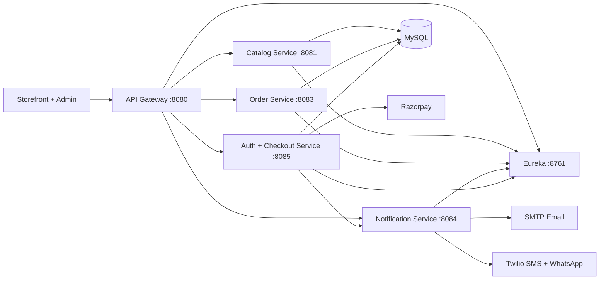

<div align="center">

# Clearly.

### A modern commerce experience for professional cleaning, hospitality and construction supplies

[](https://openjdk.org/)
[](https://spring.io/projects/spring-boot)
[](https://www.mysql.com/)
[](https://razorpay.com/)

**Discover products · Choose the right pack size · Save on bulk orders · Pay securely**

</div>


## About Clearly

Clearly is a full-stack B2B and retail storefront for cleaning and facility-care products. It brings product discovery, package-level pricing, bulk savings, customer accounts, checkout, payment verification and order communication into one responsive shopping experience.

The catalogue currently covers:

- Home care and cleaning
- Restaurant and food service
- Healthcare and institutions
- Laundry chemicals
- Swimming-pool chemicals
- Hotel and hospitality supplies
- Specialty chemicals
- Construction chemicals

## Storefront experience

| Shopping | Product details | Customer account |
|---|---|---|
| Category and brand browsing | Image carousel and size-specific images | Email/phone registration with OTP |
| Search, cart and wishlist | Package-size selector and live pricing | Password and Google sign-in |
| Customer-favourite products | Quantity-based bulk discount tables | Persistent cart and wishlist |
| Configurable ShineAll Combo | Delivery estimate by PIN code | Companies, addresses and contacts |
| Responsive category navigation | Documents, specifications and usage guidance | Order invoice and order-slip PDFs |

Every package size can have its own image, MRP, selling price and bulk-discount table. Changing the selected size updates the product presentation and pricing dynamically.

<table>
  <tr>
    <td width="50%"></td>
    <td width="50%"></td>
  </tr>
  <tr>
    <td align="center"><b>Customizable ShineAll Combo</b></td>
    <td align="center"><b>Purpose-built product categories</b></td>
  </tr>
</table>

## Admin portal

The included admin portal provides a practical interface for maintaining the storefront without editing page code.

- Create and edit products, brands, categories and subcategories
- Upload product galleries, documents and a separate image for every package size
- Maintain MRP and selling price per package
- Configure a separate bulk-discount table for each size
- Add or remove ShineAll Combo items and set combo pricing
- Change homepage copy, promotional imagery and the website accent colour
- Enable or disable automatic category scrolling
- Control product status and inspect registered users with admin authorization

Open the admin portal at **`http://127.0.0.1:4173/admin/`** when the local storefront server is running.

## Checkout and notifications

Clearly uses Razorpay for secure order creation and payment verification. After the first successful payment confirmation, the system records the order and can send:

- an order-confirmation email through SMTP;
- an SMS through Twilio;
- a WhatsApp confirmation through Twilio.

Notification channels are disabled by default and can be enabled independently through environment variables. Payment and messaging secrets are never intended to be stored in source control.

## Architecture



| Service | Port | Purpose |
|---|---:|---|
| Storefront preview | 4173 | Static storefront, admin portal and local preview API |
| API Gateway | 8080 | Public API routing and service boundary |
| Catalog Service | 8081 | Products, taxonomy, packages, media and discounts |
| Order Service | 8083 | Order lifecycle support |
| Notification Service | 8084 | Paid-order email, SMS and WhatsApp messages |
| Auth Service | 8085 | JWT authentication, profiles, shopping state and checkout |
| Discovery Service | 8761 | Eureka service registry |
| Config Server | 8888 | Centralized service configuration |

## Technology

- **Frontend:** HTML5, CSS3 and vanilla JavaScript
- **Backend:** Java 17, Spring Boot, Spring Security and Spring Cloud
- **Data:** MySQL with service-owned tables
- **Authentication:** JWT, OTP verification and Google Identity Services
- **Payments:** Razorpay Orders and Checkout
- **Documents:** OpenPDF invoices and order slips
- **Communication:** Spring Mail and Twilio
- **API documentation:** Swagger UI / OpenAPI

## Run locally

### Requirements

- Node.js 18 or newer
- Java 17
- Maven 3.9 or newer
- MySQL 8
- Redis for the complete API Gateway setup

### 1. Configure the database

Create a MySQL database named `clearly_store`, then add these environment variables to Windows **User variables** or to each service launch configuration:

```text
MYSQL_URL=jdbc:mysql://localhost:3306/clearly_store?createDatabaseIfNotExist=true&serverTimezone=UTC
MYSQL_USER=your_mysql_user
MYSQL_PASSWORD=your_mysql_password
JWT_SECRET=replace_with_a_long_random_private_value
```

The services initialize their required tables from the SQL files under their respective `src/main/resources` directories.

### 2. Configure optional integrations

```text
# Razorpay
RAZORPAY_KEY_ID=your_test_or_live_key_id
RAZORPAY_KEY_SECRET=your_test_or_live_key_secret

# Shared internal notification authentication
NOTIFICATION_INTERNAL_KEY=replace_with_a_long_random_private_value

# Email
ORDER_EMAIL_ENABLED=true
SMTP_HOST=smtp.example.com
SMTP_PORT=587
SMTP_USERNAME=your_smtp_username
SMTP_PASSWORD=your_smtp_password

# Twilio SMS
ORDER_SMS_ENABLED=true
TWILIO_ACCOUNT_SID=your_account_sid
TWILIO_AUTH_TOKEN=your_auth_token
TWILIO_SMS_FROM=your_twilio_number

# Twilio WhatsApp
ORDER_WHATSAPP_ENABLED=true
TWILIO_WHATSAPP_FROM=whatsapp:+your_twilio_number
TWILIO_WHATSAPP_CONTENT_SID=your_approved_content_sid
```

> [!IMPORTANT]
> Never commit real payment, database, SMTP or Twilio credentials. Restart the affected services after changing Windows environment variables.

### 3. Start the backend

Start the applications in separate terminals in this order:

1. `backend/discovery-service`
2. `backend/config-server`
3. `backend/catalog-service`
4. `backend/order-service`
5. `backend/notification-service`
6. `backend/auth-service`
7. `backend/gateway-service`

From each service directory, run:

```powershell
mvn spring-boot:run
```

Services that include `mvnw.cmd` may instead be started with `./mvnw.cmd spring-boot:run`.

### 4. Start the storefront

From the repository root:

```powershell
node server.js
```

Then open:

- Storefront: **http://127.0.0.1:4173/**
- Products: **http://127.0.0.1:4173/products.html**
- Admin portal: **http://127.0.0.1:4173/admin/**
- Catalog API docs: **http://localhost:8081/swagger-ui/index.html**
- Auth API docs: **http://localhost:8085/swagger-ui/index.html**

## Admin access

The Users section requires an account with the `ADMIN` role. After registering and verifying the first administrator, update that account in MySQL:

```sql
UPDATE clearly_store.users
SET role = 'ADMIN'
WHERE email = 'owner@example.com';
```

Sign out and sign in again so the refreshed JWT includes the administrator role.

## Repository structure

```text
clearly/
├── admin/                  Admin portal and database schema reference
├── assets/                 Product, category, homepage and uploaded media
├── backend/                Spring Boot microservices
├── data/                   Local preview catalogue data
├── index.html              Storefront homepage
├── products.html           Product catalogue
├── product.html            Product detail page
├── saver-pack.html         ShineAll Combo product experience
├── cart.html               Cart and checkout interface
├── account.html            Authentication and customer account entry
└── server.js               Local storefront and admin preview server
```

## Security notes

- Keep all secrets in environment variables.
- Use strong, unique values for `JWT_SECRET` and `NOTIFICATION_INTERNAL_KEY` in production.
- Set `AUTH_DEV_EXPOSE_OTP=false` outside local development.
- Use HTTPS and restricted CORS origins before production deployment.
- Use Razorpay test keys during development and live keys only in the production environment.

---

<div align="center">
  <strong>Clearly.</strong><br>
  Clean spaces. Clear mind.
</div>
